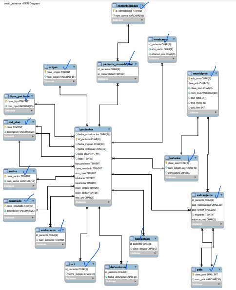

# SQL-for-COVID19

In this little project we will analyze data about COVID-19 in Mexico.

There two sections in this project: 
* Queries
* Stored Procedures

The data was provided by **Secretaría de Salud** in this link: https://www.gob.mx/cms/uploads/attachment/file/604001/Datos_abiertos_hist_ricos_2020.pdf

The dataset only contains *1,182,695* records until **August 17, 2020**.

This is the diagram of the data:

In this link you can donwload de SQL file:

https://drive.google.com/drive/folders/1EEdawyT_HHcQaFoeA4MR-jMyTSUbKGnt?usp=sharing

Let's get started!
